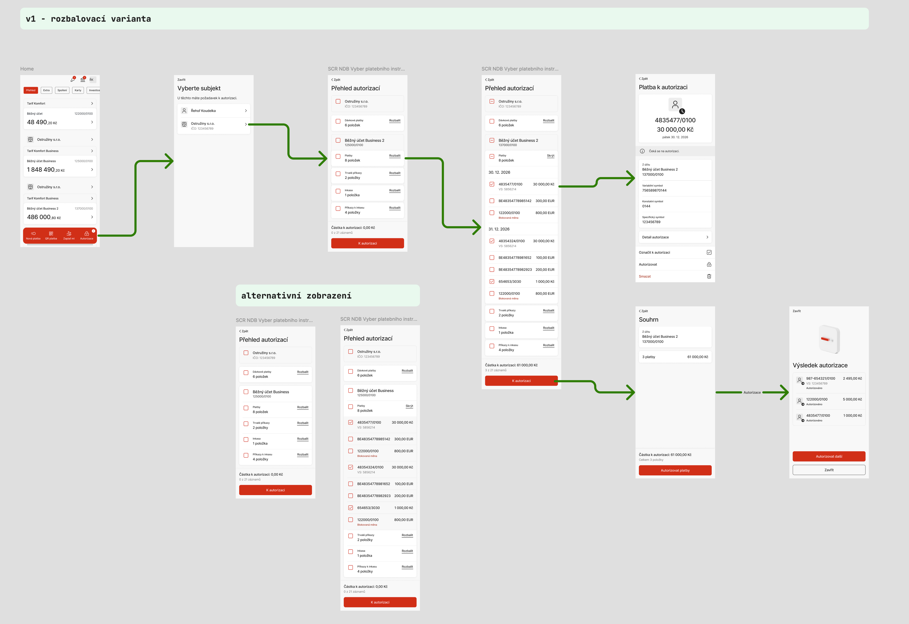
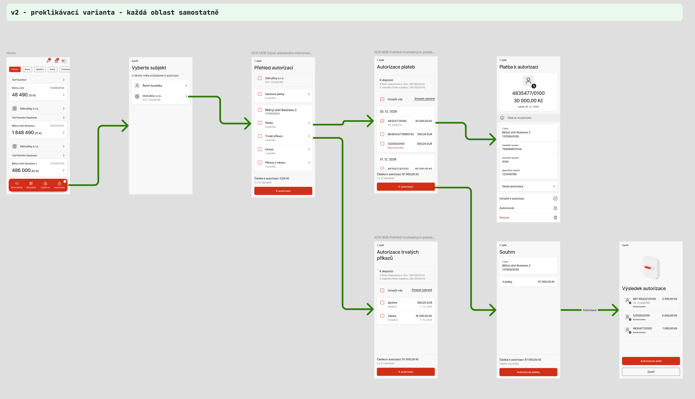
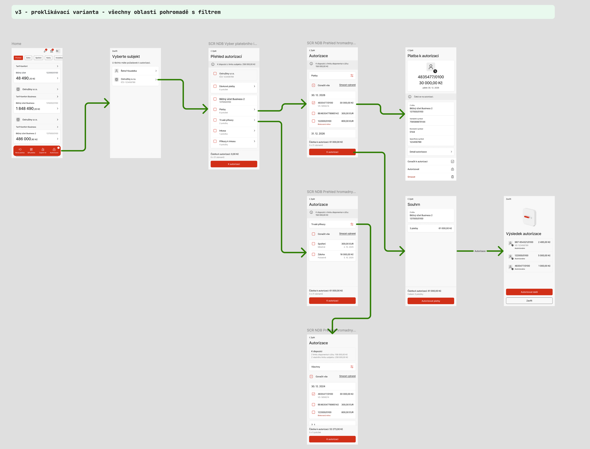

# Multiautorizace — hodnocení tří variant

2. 10. 2026. Odborné posouzení screenshotů, nikoli uživatelský výzkum.

## Doporučení pro mobil

Výchozí směr k ověření

### V2 jako základ. Z V3 převzít přepínání typů.

Na přehledu vybírat za subjekt, účet nebo typ. Jednotlivé instrumenty kontrolovat v samostatném seznamu s viditelným účtem a typem. Výběr zachovat při návratu i změně filtru a před podpisem ukázat souhrn celého výběru.

**V1 má smysl pro malé a jednoduché fronty.** Uživatel nemusí opouštět přehled, ale delší rozbalený seznam na mobilu odsune ostatní typy a účty. V2 omezuje množství informací v jednom záběru. V3 může zrychlit práci napříč typy, pokud je rozsah filtru a výběru srozumitelný.

Oproti předchozímu návrhu s rozbalováním dávám nyní větší váhu kontrole delších seznamů na mobilu. Nejde o prokázanou převahu V2: doporučení vychází z nových dodaných variant a z tvého požadavku na menší informační zátěž. Rozhodnout má test reprezentativních úkolů.

**Co tento dokument hodnotí:** tři statické návrhy dodané 2. 10. 2026. Persony jsou pracovní hypotézy, nikoli výsledky rozhovorů. Hodnocení není měření rychlosti ani audit běžící aplikace. Původní prototyp zůstává beze změny.

## Typické persony podle práce, kterou potřebují udělat

Rozlišujeme chování a odpovědnost při schvalování. Jeden člověk může během měsíce zastávat více těchto rolí. Počty níže jsou testovací scénáře, nikoli data o klientské populaci.

P1 · Občasný schvalovatel

### Majitel malé firmy

Na mobilu mezi schůzkami potvrdí několik známých plateb. Chce poznat firmu, účet a příjemce a mít jistotu, že nepotvrdil něco dalšího.

**Typický úkol:** ze 3 plateb schválit 2; u třetí otevřít detail.

**Potřeba:** jednoduchý seznam a jednoznačný souhrn. V1 může stačit; V2 je přehlednější při růstu fronty. Filtr V3 je zatím navíc.

P2 · Pravidelná kontrola

### Finanční manažer / oprávněný účetní

Kontroluje připravené instrumenty na více účtech. Střídá hromadný výběr s kontrolou výjimek a potřebuje se vrátit k rozpracované práci.

**Typický úkol:** projít 30 plateb na 3 účtech, vynechat problémovou platbu a přidat trvalý příkaz.

**Potřeba:** zachovaný výběr, účet u každé skupiny a snadné přepnutí typu. Nejslibnější je V2 s prvky V3.

P3 · Hromadné schvalování

### Jednatel potvrzující připravené dávky

Chce rychle potvrdit prověřené podklady, například mzdy. Potřebuje rozlišit podpis dávky od podpisu jednotlivé platby a vidět, co vyžaduje individuální kontrolu.

**Typický úkol:** označit 2 dávky a všechny způsobilé platby účtu, jednu platbu odebrat.

**Potřeba:** výběr z přehledu funguje ve všech variantách. Důležitější než rozbalení versus proklik je kontrolní souhrn a jasný počet dávek i podkladových plateb.

P4 · Kontrola výjimky

### Zastupující nebo druhý podepisující

Schvaluje méně často, nezná všechny příjemce a může přidávat jen svůj podpis. Vyšší prioritu má jistota než počet klepnutí.

**Typický úkol:** zkontrolovat EUR platbu, otevřít detail a autorizovat pouze ji, i když jsou vybrané další záznamy.

**Potřeba:** samostatný detail, kontext účtu a přesný výsledek „podpis přidán“. V2 má nejsnáze čitelný rozsah; V3 potřebuje výrazný filtr a informaci o skrytém výběru.

## Srovnání podle úkolů

Relativní odborný odhad: **silná** = dobře podporuje úkol v dané struktuře; **podmíněná** = závisí na upřesnění chování; **slabší** = očekávaná větší námaha. Bez číselného skóre, které by předstíralo uživatelská data.

| Úkol / kritérium | V1 · Rozbalování | V2 · Oddělené oblasti | V3 · Společný seznam + filtr |
| --- | --- | --- | --- |
| Vybrat vše za subjekt / účet | Silná: přímo v přehledu | Silná: přímo v přehledu | Silná: přímo v přehledu |
| Zkontrolovat několik položek jednoho typu | Silná při krátké frontě | Silná: soustředěný seznam | Silná: při viditelném filtru |
| Postupně projít desítky položek | Slabší: dlouhá stránka s hierarchií | Silná: jeden kontext na stránce | Podmíněná: typ a účet musí zůstat čitelné |
| Přidat jednotlivosti z více typů | Podmíněná: méně navigace, více scrollu | Slabší: návraty do přehledu | Silná, pokud filtr zachová výběr |
| Orientace občasného schvalovatele | Podmíněná: hierarchie na jedné stránce | Silná: konkrétní název oblasti | Podmíněná: filtr a skrytý výběr |
| Viditelnost všech vybraných záznamů | Podmíněná: výběr může být ve sbalené části | Podmíněná: výběr může být na jiné stránce | Podmíněná: výběr může být odfiltrovaný |
| Škálování na více účtů | Slabší po rozbalení více skupin | Podmíněná: více přechodů, jasný kontext | Podmíněná: nejasný rozsah společného seznamu |

**Společný závěr:** samotné hromadné označení nerozhoduje mezi variantami, protože jej mají všechny. Rozdíl je hlavně v práci s výjimkami a jednotlivými položkami.

## V1 · Rozbalovací varianta

Přehled zůstává pracovní plochou. Typ otevře seznam uvnitř účtu, řádek vede do detailu.

Zdroj: uživatelem dodaný návrh. Klepnutím otevřeš původní obrázek v plném rozlišení.

### Plusy

- Kontext účtu i ostatní typy jsou součástí stejné stránky.
- K jednotlivým položkám stačí rozbalení; není nutný návrat z dalšího seznamu.
- Výběr skupiny a odebrání výjimky jsou blízko sebe.
- Alternativní zobrazení v jedné kartě lépe drží vztah účet → typ → položka.

### Mínusy a rizika

- Na horní rozbalené obrazovce zabírá osm plateb velkou část stránky; další typy jsou až pod nimi. Mobilní výřez proto neukáže celý účet.
- Po otevření více skupin uživatel hledá místo dlouhým scrollováním; sbalení může posunout pozici.
- Checkboxy na třech úrovních vyžadují výraznou hierarchii a srozumitelnou pomlčku.
- Výběr z uzavřených skupin zůstává skrytý. Spodní počet sám neříká, kde jsou vybrané záznamy.

**Pro koho:** Pro P1 s několika položkami nebo pro rychlé označení celého účtu. Pro P2 s delší frontou méně vhodná jako jediný způsob kontroly.

**Co upravit před testem:** Zachovat jednu kartu účtu, odlišit vložený seznam odsazením a jemným pozadím, ne zmenšováním textu. Na mobilu použít jeden scroll stránky a pevný souhrn. Pro delší fronty nabídnout „Otevřít seznam“. Datumové skupiny mají smysl při kontrole splatnosti; jejich přínos ověřit, ne automaticky odstranit.

## V2 · Každá oblast samostatně

Přehled vybírá skupiny. Platby i trvalé příkazy mají vlastní stránku s odpovídajícím názvem.

Zdroj: uživatelem dodaný návrh. Klepnutím otevřeš původní obrázek v plném rozlišení.

### Plusy

- Samostatná stránka omezuje množství různých informací v jednom mobilním záběru.
- Názvy „Autorizace plateb“ a „Autorizace trvalých příkazů“ jasně říkají, co uživatel prohlíží.
- Každý typ může ukazovat vlastní relevantní údaje: splatnost u plateb, periodicitu u trvalých příkazů.
- Struktura je blízká předchozí cestě přehled → seznam → detail.

### Mínusy a rizika

- Při kombinaci plateb a trvalých příkazů musí uživatel přejít přes přehled. To přidává navigaci.
- Na seznamu je limit, ale název a číslo zdrojového účtu nejsou výrazně zobrazené. Při více účtech hrozí ztráta kontextu.
- „Označit vše“ může znamenat aktuální seznam, zatímco spodní souhrn zjevně může počítat celý výběr. Rozsah není pojmenovaný.
- „Smazat vybrané“ je vedle hromadného označení v primární schvalovací cestě; zvyšuje riziko záměny akcí.

**Pro koho:** Nejlepší základ pro P1 a P4; pro P2 potřebuje kratší přepínání oblastí. P3 využije především přehled a souhrn.

**Co upravit před testem:** Nad seznam dát subjekt, účet a typ. Zachovat společný výběr při návratu. Přidat přepnutí typu v rámci stejného účtu jako rozšíření, nikoli zaměnit typ bez viditelné změny kontextu. Mazání přesunout do dalších akcí a potvrdit jeho rozsah.

## V3 · Společný seznam s filtrem

Proklik z typu otevře jednu stránku Autorizace s filtrem přednastaveným na daný typ. Lze zobrazit Všechny.

Zdroj: uživatelem dodaný návrh. Klepnutím otevřeš původní obrázek v plném rozlišení.

### Plusy

- Jedna pracovní plocha může omezit návraty při kombinování více typů.
- Aktivní typ je napsaný v ovladači, nejde pouze o anonymní ikonu filtru.
- Uživatel může po prvním prokliku rozšířit zobrazení na všechny typy.
- Společný seznam je perspektivní pro pravidelné schvalování, pokud nabízí hledání a stabilní kontext.

### Mínusy a rizika

- Není jasné, zda „Všechny“ znamená typy aktuálního účtu, všechny účty, nebo celý subjekt. Diagram dokládá vstup z účtu; celosubjektový rozsah neprokazuje.
- V režimu Všechny potřebuje každý řádek nebo skupina označení typu. Částka sama nerozliší platbu, pravidelný příkaz a inkasní limit.
- Po změně filtru mohou být vybrané položky neviditelné. „Označit vše“ a finální akce nesmějí mít nejasný rozsah.
- Obecný název Autorizace méně pomáhá při orientaci; kombinace limitů a smíšených typů vyžaduje vysvětlení.

**Pro koho:** Nejslibnější pro P2. Pro P1 a P4 je vhodná jen s výchozím konkrétním typem a čitelným rozsahem.

**Co upravit před testem:** Začít variantou V3 omezenou na typy jednoho účtu. Filtr pojmenovat například „Typ: Platby“ / „Všechny typy“. Nad ním trvale uvést účet. Výběr napříč účty řešit v přehledu a souhrnu; celosubjektový společný seznam zavést až po ověření potřeby. Ukázat počet vybraných mimo filtr.

## Hodnocení společné customer journey

Čísla odpovídají krokům na přiložených diagramech; jde o stav návrhu, ne o ověřenou funkčnost.

- **Home → Autorizace · dobrý základ.** Vstup je ve spodní liště. Badge s vykřičníkem upozorní, ale neřekne počet čekajících požadavků. Doplnit čitelný počet.
- **Výběr subjektu · dobrý základ.** Firma a fyzická osoba jsou odlišené, firma má IČO. Doplnit počty; výběr nikdy nepřenášet do jiného subjektu.
- **Přehled subjekt / dávky / účty / typy · potřebuje pravidla.** Všechny varianty mají skupinové checkboxy. Doplnit textový rozsah, počty vybraných a informaci o nezpůsobilých položkách.
- **Výběr jednotlivostí · hlavní rozdíl variant.** V1 mění výšku přehledu; V2 otevírá oddělenou oblast; V3 navíc filtruje společný seznam. Ve všech případech musí zůstat společný stav výběru a oddělené ovládání detailu.
- **Detail a kontrolní souhrn · nutné doplnit rozsah.** Detail ukazuje účet a platební údaje. „Autorizovat“ v detailu musí potvrdit jen otevřený instrument. Souhrn v diagramech ukazuje jediný účet a „3 platby“; nedokládá smíšený výběr přes více účtů a typů.
- **Výsledek · dobrý princip, neúplné stavy.** Položkový výsledek umožní kontrolu. Doplnit částečný neúspěch, čekání na druhý podpis a návrat k nezpracovaným položkám.

## Pravidla, bez kterých nebude bezpečná žádná varianta

### Výběr není filtr

Checkbox subjektu vybere všechny způsobilé záznamy subjektu. Checkbox účtu či typu vybere svou skupinu. V seznamu použít „Vybrat zobrazené (8)“; změna filtru ani sbalení výběr nemaže.

Spodní lišta: **„Vybráno celkem 5 záznamů · 2 mimo tento filtr“**. Odkaz „Zobrazit výběr“ otevře vše vybrané. Pomlčka znamená částečný výběr; vedle ní zobrazit například „2 z 8 vybrány“.

### Součet není jedna částka všeho

Platby sčítat po měnách. EUR a Kč neslučovat bez vysvětleného přepočtu. Trvalý příkaz představuje pravidelnou částku, svolení k inkasu limit; nejsou totožné s okamžitým odchozím tokem.

Při smíšeném výběru dát dopředu počet záznamů. Souhrn rozdělit podle účtu, typu a měny; inkasní limity a pravidelné částky označit zvlášť.

### Dávka potřebuje jednotku

„6 položek“ u dávkových plateb nerozlišuje 6 dávek od 6 plateb uvnitř dávky. Použít „2 dávky · 6 plateb“. Dávky mimo účty nepřičítat znovu do běžných plateb účtů.

Nedělitelnost dávky je stále předpoklad původního prototypu. Možnost částečného podpisu je potřeba potvrdit s produktem; obrázky ji neřeší.

### Problémové položky a podpis

Blokovaná měna a chybná platba potřebují vysvětlení a stav „Nelze autorizovat“. Do hromadného výběru zahrnout jen způsobilé; říci kolik a proč se vynechalo. Detail nechat otevřitelný.

Před podpisem znovu ověřit oprávnění a limity. Výsledek musí rozlišit autorizováno, podpis přidán, chyba. „Autorizovat další“ nesmí znovu podepsat již dokončené záznamy.

## Konkrétní nálezy v obrázcích

- **V1, alternativní rozbalený přehled:** jsou vidět zaškrtnuté jednotlivé platby, ale rodičovské checkboxy a souhrn „0 z 21“ / „0,00 Kč“ tomu neodpovídají. Horní rozbalená verze už ukazuje pomlčky a 61 000 Kč. Sjednotit návrhové stavy.
- **V2 a V3, trvalé příkazy:** viditelné řádky nejsou označené, ale dole zůstává výběr 3 z 21 a 61 000 Kč. To může být správně, pokud jde o výběr z jiné oblasti; obrazovka však tuto skutečnost nevysvětluje. Doplnit počet mimo aktuální oblast.
- **V3, Všechny:** souhrn mění počet na „3 z 5 položek“ a částku na 53 273 Kč. Z diagramu není patrné proč. Pokud se změnil jen filtr, celkový výběr se změnit nemá; počet zobrazených uvést odděleně. Pokud jde o jiná ukázková data, sjednotit je pro porovnání.
- **Všechny varianty, souhrn → výsledek:** vybrané platby a částky ve výsledku neodpovídají předchozímu příkladu 61 000 Kč. To beru jako nesjednocená ukázková data, nikoli důkaz chyby systému. Pro test musí být celý příběh konzistentní.
- **Všechny varianty, seznam → detail:** nespoléhat na klepnutí na celý řádek, pokud v něm zároveň vybírám. Checkbox a otevření detailu musí mít oddělené dotykové oblasti.

### Přístupnost a mobilní ovládání

Ze zmenšených diagramů nelze změřit skutečné dotykové plochy, kontrast, pořadí fokusu ani podporu čtečky. Ověřit na mobilním prototypu: zvětšení textu, dlouhé IBAN, 320–430 CSS px, klávesnici a čtečku. Jako návrhový cíl použít dotykové plochy kolem 44 × 44 CSS px; nejde o minimum WCAG 2.2 AA, které je 24 × 24 CSS px nebo splnění příslušných výjimek. [W3C: velikost cíle](https://www.w3.org/WAI/WCAG22/Understanding/target-size-minimum.html).

Stav částečného výběru sdělit i programově; rozbalení má vlastní popisek a stav expanded. Chybu neoznačovat pouze červenou barvou. [W3C: checkbox a částečný výběr](https://www.w3.org/WAI/ARIA/apg/patterns/checkbox/).

## Co přináší předchozí rešerše

Veřejné zdroje znovu zkontrolovány 2. 10. 2026. Dokládají vzorce a omezení konkrétních produktů; neurčují vítěze těchto tří variant.

### HSBCnet Mobile · doložený proklik a detail

Oficiální příručka z dubna 2025 popisuje přehled počtů podle typu, přechod do seznamu, checkbox a detail instrukce. Get Rate není dostupný při hromadné autorizaci. To podporuje smysluplnost V2 a nutnost vyřadit operace vyžadující individuální postup, nikoli tvrzení, že V2 je nejlepší pro naše klienty.

[Oficiální příručka HSBCnet](https://www2.secure.hsbcnet.com/pims/static/dtc/cms/content/dam/nett/user-guides/pdf/pdf-guides-on-pws/mobile/using-services/payauth_getrate/payauth_getrate.pdf)

### Raiffeisenbank a NatWest · omezená váha pro rozhodnutí

Předchozí návrh uvádí hromadné potvrzení u RB a Payment Summary / dávky v popisu NatWest Bankline Mobile. Nešlo o ověření přihlášených aplikací. Na aktuálně otevřené stránce RB se původní konkrétní popis hromadných plateb znovu nepodařilo dohledat, proto jej nepoužívám jako nový důkaz pro pořadí variant. NatWest zde nebyl znovu ověřován.

[Původní rešerše a její přesné zdroje](navrh.md) · [Aktuálně kontrolovaná stránka RB](https://www.rb.cz/osobni/ucty/sluzby-k-uctum/internetove-bankovnictvi/tipy)

**Vlastní návrhové závěry:** filtrování nemá mazat výběr, skrytý výběr je potřeba zviditelnit a na mobilu oddělit kontrolu delšího seznamu od přehledu. Tyto závěry jsou odborné hypotézy k testování.

## Jak rozhodnout mezi variantami

Navrhuji moderovaný test na mobilu s 6–8 lidmi pokrývajícími výše uvedené role. Výsledek bude kvalitativní; z takového vzorku nelze odhadovat procenta celé klientské populace. Pořadí variant střídat a používat srovnatelná data.

| Úkol | Co sledovat |
| --- | --- |
| Vybrat vše za subjekt včetně dvou dávek; vysvětlit vynechanou blokovanou platbu. | Správný rozsah, porozumění dávkám a způsobilosti. |
| Vybrat všechny platby účtu, jednu odebrat a přidat jeden trvalý příkaz. | Návraty, scroll, ztráta místa a zachování výběru. |
| Po výběru změnit typ / filtr a říci, co se podepíše. | Rozlišení zobrazených a celkem vybraných záznamů. |
| Otevřít detail EUR platby a autorizovat pouze ji při existujícím jiném výběru. | Nechtěné rozšíření podpisu; porozumění měnám. |
| Zpracovat 30 položek na 3 účtech; obnovit stránku a vrátit se. | Ztráta kontextu, persistence, orientace v delší frontě. |
| Přečíst částečný výsledek s druhým podpisem a jednou chybou. | Rozlišení dokončených a nedokončených záznamů. |

**Rozhodovací priorita:** nejdřív správný rozsah podpisu a žádné nechtěné záznamy, potom porozumění souhrnu, nakonec čas, počet klepnutí a preference. Variantu nepřijmout pouze proto, že je rychlejší, pokud uživatel nerozumí skrytému výběru.

**Další iterace:** otestovat V2, V3 omezenou na typy jednoho účtu a V1 s krátkou i delší frontou. Teprve podle výsledků rozhodnout, zda má být rozbalení doplňkový rychlý režim, nebo hlavní cesta.
